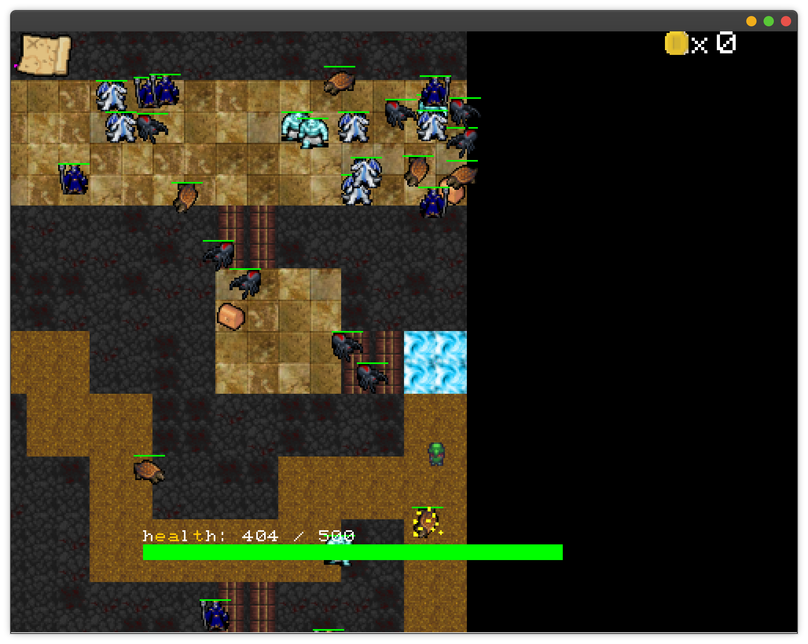

# 05： Rouge Like

## 游戏预览



## 代码结构

```
.
├── com
│   └── pFrame //简易UI实现
│       ├── PFont.java	//加载字体文件，提供字体的图像
│       ├── pgraphic //图形有关，参考QT
│       │   ├── PGraphicItem.java //图形item
│       │   ├── PGraphicScene.java //放置和管理item的类，采用了划分区域的方式管理items
│       │   ├── PGraphicView.java	//继承了PWidget,是一个图形组件，观察scene内的items
│       │   └── PView.java //useless
│       ├── Pixel.java	//存储单个pixel的颜色，存储该pixel的形状
│       ├── Position.java //ui组件,item的位置
│       ├── PTimer.java //类似Timer的计时器
│       ├── PTimerTask.java //为PTimer计时器指定计时结束后执行的任务所需要实现的接口
│       └── pwidget //ui组件
│           ├── ObjectUserInteractive.java //类似keylistener,mouselistener,mosueWheelListener接口的组合体，专为ui组件传递鼠标键盘事件用。
│           ├── PButton.java //按钮组件
│           ├── PFrame.java //继承JFrame,图形输出
│           ├── PFrameKeyListener.java //专为想要监听鼠标事件的模块和类提供的接口。
│           ├── PHeadWidget.java //继承PWidget,承载单个窗口其它所有的Widget组件的容器
│           ├── PImage.java //继承PWidget,展示图像
│           ├── PLabel.java //输出文字的ui组件
│           ├── PLayout.java //PWidget,布局组件,可以直接当容器添加其它组件；也可以设置为其它ui组件的layout。在组件时可以按照预定格式为新组件自动分配位置和大小，在自身大小和位置发生变化时，也可以自动调整layout里的组件位置和大小。
│           └── PWidget.java //所有ui组件的父类
├── game
│   ├── ApplicationMain.java //启动game
│   ├── Attack.java //包装单次攻击的类，角色攻击时创建一个Attack,输入数值和范围等信息，交由world处理
│   ├── Config.java //暂未用到
│   ├── controller //角色控制器
│   │   ├── AlogrithmController.java //控制monster行为的控制器
│   │   ├── CreatureController.java //控制器接口
│   │   └── KeyBoardThingController.java //键盘控制器
│   ├── CreatureProperty.java //useless
│   ├── graphic //图形有关
│   │   ├── bullet //子弹
│   │   │   ├── Bullet.java //子弹的基类，继承了thing,定义的子弹的生成，运动、判定和行为逻辑。
│   │   │   ├── NormalBullet.java //玩家打出的子弹
│   │   │   ├── SpiderShoot.java //蜘蛛射出的子弹
│   │   │   └── Wind.java //龙（射出）的龙卷风
│   │   ├── creature //生物
│   │   │   ├── Controllable.java //定义一个可以被控制器控制所需要实现的接口
│   │   │   ├── Creature.java //生物的基类，继承于thing，实现生物的运动，speak,死亡，各种生物属性的管理。
│   │   │   ├── monster //怪物，除IceAttack,Vine全部继承于Monster
│   │   │   │   ├── Dragon.java //龙
│   │   │   │   ├── IceAttack.java //雪怪攻击
│   │   │   │   ├── Master.java //法师，追踪玩家，生成大范围藤蔓困住玩家和阻挡玩家攻击。
│   │   │   │   ├── Monster.java //怪物基类，继承Creature
│   │   │   │   ├── Pangolin.java //穿山甲，撞击玩家并使自己眩晕一段时间
│   │   │   │   ├── SnowMonster.java //雪怪，追击玩家创造范围冰雪覆盖，每隔一段时间附加一次攻击
│   │   │   │   ├── Spider.java //蜘蛛，本身血量很低，但高频高伤攻击
│   │   │   │   └── Vine.java //藤蔓
│   │   │   └── operational //自机角色
│   │   │       ├── Calabash.java //葫芦娃？
│   │   │       └── Operational.java //自机角色的基类
│   │   ├── Direction.java //方向类，提供上下左右常见方向的值，提供方向计算
│   │   ├── effect //特效，所有特效继承effect，effect继承thing
│   │   │   ├── BloodChange.java //血量降低特效
│   │   │   ├── BulletHit.java //子弹击中特效
│   │   │   ├── Dialog.java //对话框
│   │   │   ├── Effect.java //所有特效的基类
│   │   │   ├── Hit.java //穿山甲撞中物体的特效
│   │   │   └── Swoon.java //眩晕特效
│   │   ├── env //环境物体，继承thing
│   │   │   ├── CorridorFloor.java //走廊地板
│   │   │   ├── Door.java //连接走廊和房间的地方
│   │   │   ├── RoomFloor.java //房间地板
│   │   │   └── Wall.java //墙
│   │   ├── interactive //可交互物体，继承于thing
│   │   │   ├── Box.java //宝箱
│   │   │   ├── buff //地上的buff
│   │   │   │   ├── Addition.java //使用buff生成Addition,使用Addition后一段时间后获得强化
│   │   │   │   ├── AttackBuff.java //攻击buff
│   │   │   │   ├── Buff.java //buff基类
│   │   │   │   ├── HealthBuff.java //生命值buff,永久恢复生命值
│   │   │   │   ├── ResistanceBuff.java //抗性Buff,使用后一定时间时间伤害减免效果增强
│   │   │   │   └── SpeedBuff.java //一时间内，移动速度增加
│   │   │   ├── Coin.java //生物死亡后掉落金币，一定范围内有玩家是，自动靠近回收
│   │   │   ├── ExitPlace.java //地图出口
│   │   │   └── GameThread.java //游戏线程管理类，所有生成的线程生成时添加到set里，结束后删除
│   │   ├── Thing.java //thing基类
│   │   └── Tombstone.java //墓碑，生物死亡后生成
│   ├── Location.java //不可覆盖的物体占据的tile的位置
│   ├── screen //屏幕ui
│   │   ├── Bag.java //暂未实现
│   │   ├── HealthBar.java //生命条，展示玩家生命值，继承于PWidget
│   │   ├── MessageLabel.java //在游戏上方发送message
│   │   └── UI.java //基于fPrame提供和自定义的组件构建的ui
│   └── world
│       ├── Tile.java //整个世界被分成多个大小相同的tile,生物的位置可以不和tile对齐，但每个生物只能占据一个tile。
│       └── World.java //管理游戏资源的最重要的类，管理怪物移动，attack处理等。还有一个专门的线程用来管理怪物的回收和放置，为了提高性能，离玩家远的怪物和可交互物会被暂时收起。
├── imageTransFormer
│   ├── GraphicItemGenerator.java
│   ├── GraphicItemImageGenerator.java
│   ├── ObjectTransFormer.java
│   └── Test.java
├── log
│   └── Log.java
├── mazeGenerator
│   ├── Main.java
│   ├── MazeGenerator.java
│   ├── Node.java
│   └── README.md
├── META-INF
│   └── MANIFEST.MF
└── worldGenerate
    └── WorldGenerate.java //地图生成
```


## 游戏特性

- 地图完全随机生成，大致流程：先借助jw04的迷宫生成算法生成一个完美的迷宫；去除一定数量的迷宫的死胡同；在剩下的空间中尝试随机插入大小随机的房间；将生成的房间和走廊连接起来。这样生成的地图同时得到了房间的位置和大小信息，以便在生成world时对房间进行特殊化定制。由于时间原因，这里房间里的怪物和房间外的只有出现概率差异。
- 超大地图支持，地图视野随着操作角色的移动自动调整；为了实现这个效果，我自己的简陋的ui实现了一个view-scene结构。为了加快渲染速度，计算画面时，只有在视野内的scene的部分的items会被计算，后创建的item渲染时默认覆盖先创建的item对象。同时，为了防止交互物、生物等过多造成卡顿。游戏部分的world会启动一个维护线程，自动停止离角色较远的可交互对象和生物的线程，并从world中暂时移除。
- 游戏中每一个怪物、怪物的创造物、怪物和玩家打出的子弹、特效、生物死亡掉落的金币、对话框、宝箱、地图出口等可交互物都是一个线程（每个怪物由一个controller线程控制）。为了避免玩家长按键盘时，键盘的延迟对游戏手感造成影响，键盘的响应部分也做成了一个线程。为了保证游戏程序的准确无误，游戏每创建一个自定义的线程，都会向GameThread.threadSet集合中添加创建的线程，并在结束后移除，单个游戏实例结束时，world向thraedSet中每个thread发送interupt。所有线程退出后，游戏退出。
- ui：自己实现的简陋的框架，支持控件自动布局、动态添加删除控件、支持响应窗口大小变化、支持鼠标键盘事件的传递、提供键盘监听功能，实现了几种基本的组件。
- 怪物设计：
  - 怪物逻辑：目前所有怪物共用一套基本逻辑:未发现目标：随机移动、索敌 -->  有目标：对目标作出反应（具体怪物单独定制）--> 敌人距离过远、被墙阻挡视线或者杀死敌人，脱战
  - 怪物具体介绍：参考代码结构部分。
- ......

## 游戏操作

- 'W','A','S','D':控制方向
- 'J':攻击
- 靠近宝箱，宝箱会自动打开，随机掉落buff,捡拾buff自动获得一定时间的加成
- 地图中蓝色的点位（出生点）按'f'交互可以退出地图

## 外部参考

- 肉鸽地牢生成算法思路参考：https://indienova.com/indie-game-development/rooms-and-mazes-a-procedural-dungeon-generator/
- 本项目绝大部分图片资源来自https://opengameart.org/
